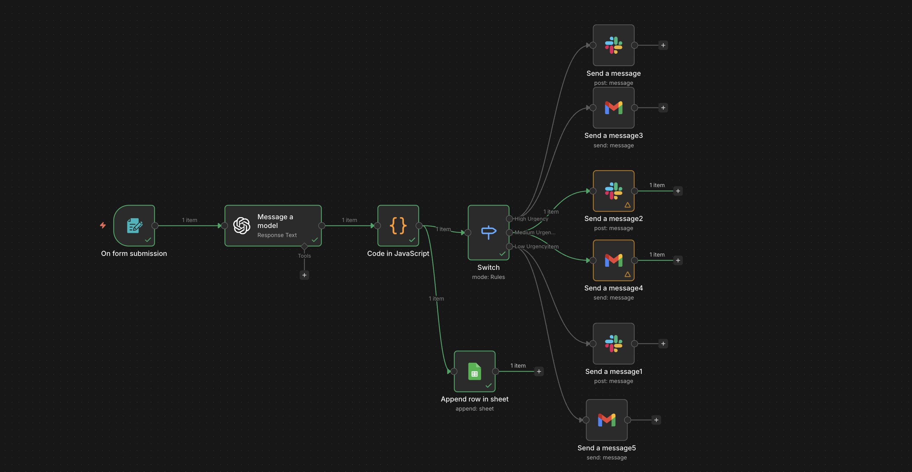

# ai-customer-support-pipeline
> A real-world AI workflow that automates customer support triage using n8n and OpenAI.

## Architecture

The system is designed as an automated customer support intake pipeline that transforms unstructured user complaints into structured tickets and routes them through internal workflows.

**Pipeline Flow:**

User Form Submission  
→ AI Classification & Summarization  
→ Ticket ID Generation  
→ CRM Logging (Google Sheets)  
→ Urgency-Based Routing  
→ Slack Internal Alert  
→ Customer Email Confirmation

Incoming support messages are analyzed by an AI model to determine urgency and generate a concise summary. The workflow sanitizes and structures the output, assigns a unique ticket ID, and logs the record into a CRM-style database layer.

Based on urgency level, the system automatically routes notifications to internal teams while simultaneously sending a confirmation email to the customer.

This architecture demonstrates how AI can function as a decision layer inside real-world operational pipelines rather than as a standalone chatbot.

### Design Principles

- Structured JSON pipeline contract
- AI output normalization for deterministic routing
- Stateless workflow execution
- SaaS integration as persistent storage layer
- Event-driven automation architecture

## Screenshots

### Workflow Overview

### CRM Logging (Google Sheets)

### Slack Alert

### Customer Email Confirmation

